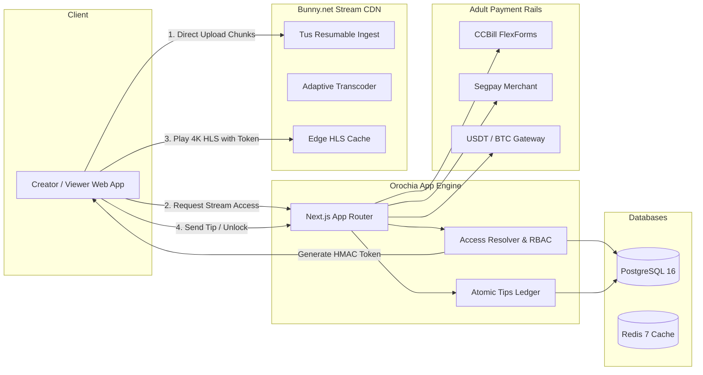

<div align="center">

# 🥷 OROCHIA
### Adult-Friendly Open-Source Video & Creator Community Platform

[](LICENSE)
[](https://nextjs.org/)
[](https://orm.drizzle.team/)
[](https://bunny.net/)
[](https://www.digitalocean.com/products/app-platform)

**Orochia** is an enterprise-grade, privacy-first, adult-friendly video streaming and creator monetization platform engineered by **Krizaka**. Built to eliminate platform censorship and payment provider deplatforming risks through direct Bunny.net edge streaming, tokenized HMAC paywalls, and multi-rail adult payment adapters (CCBill, Segpay, Crypto).

### 🌐 The Orochia Ecosystem
- **Consumer Web App**: [`krizaka/orochia`](https://github.com/krizaka/orochia) (Port 3000)
- **Admin Control Plane & 2257 Vault**: [`krizaka/orochia-admin`](https://github.com/krizaka/orochia-admin) (Port 3001)
- **Design System & Tokens**: [`krizaka/orochia-design-system`](https://github.com/krizaka/orochia-design-system) (Port 3002)

[Explore Architecture](docs/ARCHITECTURE.md) • [Media Pipeline](docs/MEDIA_PIPELINE.md) • [Market Analysis & Lore](docs/MARKET_ANALYSIS_AND_LORE.md) • [Deployment Guide](docs/DEPLOYMENT.md)

</div>

---

## 🌟 Key Architectural Highlights

- ⚡ **Dual-Mode DevX Storage**: Zero-latency local filesystem uploads (`public/uploads`) during development; auto-switches to Bunny Edge Storage and Bunny Stream Tus protocol in staging and production.
- 📺 **Bunny.net Native Feature Suite**: Video libraries, curated series collections, adaptive 4K HLS ladders (AV1, VP9, H.264), global 114 PoP cache telemetry, and emergency sub-250ms CDN cache invalidation.
- 🛡️ **18 U.S.C. § 2257 Performer Compliance**: Encrypted primary producer government ID archives, federal custodian record locations, and certified audit log generation.
- 💰 **4-Tier Platform Administrator Monetization**: 10% protocol rake, $49 federal onboarding audit fees, Sanctuary Spotlight homepage auctions ($25/day), and 1.5% instant crypto/fiat payout fees.
- 🔒 **Token-Authenticated HLS Streams**: Signed HMAC-SHA256 playlist tokens prevent hotlinking, URL scraping, and unauthorized downloading of paywalled content.
- 💳 **Adult-Compliant Payment Rails**: Out-of-the-box adapters for CCBill Dynamic Pricing, Segpay One-Time Billing, and NowPayments / BTCPay Crypto with atomic double-entry bookkeeping.
- 🚀 **1-Click DigitalOcean Deploy**: Native `app-spec.yaml` configured for DigitalOcean App Platform with managed PostgreSQL and Redis clusters.

---

## 🏗️ Architecture Topology



---

## 📦 Monorepo Structure

```text
orochia
├── .github/
│   ├── workflows/ (ci.yml, release.yml, deploy-do.yml)
│   └── ISSUE_TEMPLATE/ (bug_report.yml, feature_request.yml)
├── apps/
│   └── web/ (Next.js 14 App Router, HLS Video Player, Creator Studio, Payouts)
├── packages/
│   ├── db/ (Drizzle ORM schema, PostgreSQL migrations, Seed factory)
│   ├── media/ (Bunny.net Stream SDK wrapper, Tus signing, HMAC token auth)
│   ├── payments/ (CCBill, Segpay, Crypto, Stripe adapters, Double-entry ledger)
│   └── config/ (Shared ESLint, TypeScript, and Tailwind configurations)
├── deploy/
│   ├── docker/ (Multi-stage Dockerfile, docker-compose.dev.yml, docker-compose.prod.yml)
│   └── digitalocean/ (app-spec.yaml for DigitalOcean App Platform)
├── docs/
│   ├── ARCHITECTURE.md
│   ├── MEDIA_PIPELINE.md
│   └── DEPLOYMENT.md
├── README.md
└── LICENSE
```

---

## 🚀 Quickstart & Local Development

### 1. Prerequisites
- Node.js 20+
- Docker & Docker Compose

### 2. Boot Local Environment
```bash
# Clone the repository
git clone https://github.com/krizaka/orochia.git
cd orochia

# Start PostgreSQL 16 & Redis 7 containers
docker compose -f deploy/docker/docker-compose.dev.yml up -d

# Copy environment template
cp .env.example .env

# Install monorepo dependencies
npm install

# Run database migrations and seed demo data
npm run db:generate
npm run db:migrate
npm run db:seed

# Launch Next.js development server
npm run dev
```

Visit [http://localhost:3000](http://localhost:3000) to explore the platform.
Health check endpoint: [http://localhost:3000/api/health](http://localhost:3000/api/health).

---

## ☁️ 1-Click Deploy to DigitalOcean

Deploy directly to DigitalOcean App Platform with managed PostgreSQL and Redis clusters:

[](https://cloud.digitalocean.com/apps/new?repo=https://github.com/krizaka/orochia/tree/main)

Alternatively, deploy using `doctl`:
```bash
doctl apps create --spec deploy/digitalocean/app-spec.yaml
```

---

## 📜 Roadmap & Milestones

Track development progress on the [orochia Stream Core Engine Project Board](https://github.com/orgs/krizaka/projects/1):

- **M1: Foundation & Data Architecture** — PostgreSQL schema, Drizzle ORM, RBAC guards.
- **M2: Media Pipeline & Bunny.net Integration** — Direct Tus signing, webhook processor, HLS player.
- **M3: Social Graph & Access Control** — Contacts engine, granular video visibility matrix.
- **M4: Paywall & Tips System** — CCBill/Segpay/Crypto adapters, double-entry escrow ledger.
- **M5: Playlists & Community Feeds** — Curated creator playlists, algorithmic recommendations.
- **M6: Open Source DX & DigitalOcean CI/CD** — Docker multi-stage builds, App Platform spec, docs.

---

## 📄 License

Licensed under the [Apache License, Version 2.0](LICENSE).  
Copyright (c) 2026 Krizaka Organization.
