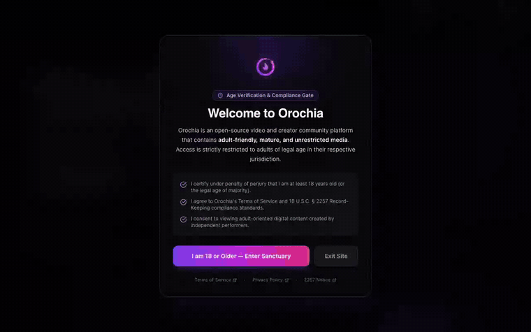
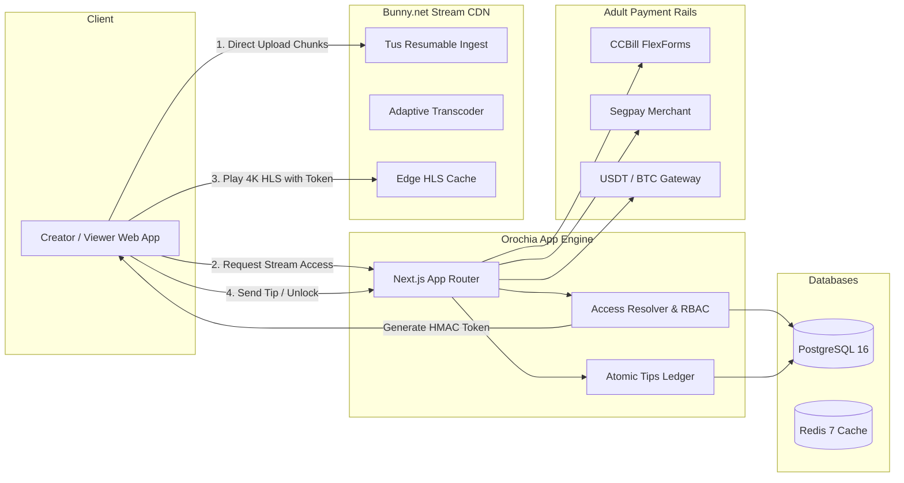

<!-- krizaka-header -->
<div align="center">



# Orochia

**Creators get paid. Every cent, exactly once.**

The creator video platform: direct-to-CDN 4K streaming, server-side access control, gateway-confirmed payments settled exactly once on a double-entry ledger, and built-in 18+ compliance.

[](https://github.com/krizaka/orochia/actions/workflows/ci.yml)
[](LICENSE)
[](https://www.krizaka.com/en/products/orochia#guarantees)
[](https://www.krizaka.com/en/products/orochia/docs)

[Documentation](https://www.krizaka.com/en/products/orochia/docs) · [Website](https://www.krizaka.com) · [Krizaka on GitHub](https://github.com/krizaka)

</div>
<!-- /krizaka-header -->

<p align="center">
  <a href="https://www.krizaka.com/en/products/orochia#tour"></a>
  <br><sub>Orochia — feed, playback and tipping, recorded on the latest build · <a href="https://www.krizaka.com/en/products/orochia#tour">more on krizaka.com</a></sub>
</p>

---

## 🌟 Key Architectural Highlights

- 📺 **Direct-to-CDN media**: uploads go straight to Bunny Stream over Tus; playback uses HMAC-signed HLS URLs that expire after 5 minutes. Video never passes through the app servers.
- 🔐 **Server-side access control**: every play is authorised against the video's visibility — public, contacts only, or unlocked — before a URL is signed.
- 💳 **Gateway-confirmed payments**: an unlock records a payment intent and sends the buyer to CCBill, Segpay, NowPayments (crypto) or Stripe; access is granted only when the gateway's signed webhook confirms it, exactly once.
- 📒 **Double-entry ledger**: platform fee and creator credit always add up to the gross; balances are computed from the ledger; concurrent payout requests are serialised.
- 🛡️ **18 U.S.C. § 2257 & safety**: 18+ certification at sign-up, creator verification before upload, persisted content reports (non-consensual content, suspected minors, DMCA).
- 🚦 **Fail-closed configuration**: production refuses to run on missing secrets and has no demo mode; security headers (HSTS, frame denial, nosniff) on every response.
- 🚀 **Deployable**: multi-stage Docker image with a bundled migrator, DigitalOcean App Platform spec with a PRE_DEPLOY migration job, CI with lint, typecheck, tests, build and migrations on PostgreSQL 16.

---

## 🏗️ Architecture Topology



---

## 📦 Monorepo Structure

```text
orochia
├── .github/
│   ├── workflows/ (ci.yml, release.yml, deploy-do.yml)
│   └── ISSUE_TEMPLATE/ (bug_report.yml, feature_request.yml)
├── apps/
│   └── web/ (Next.js 14 App Router, HLS Video Player, Creator Studio, Payouts)
├── packages/
│   ├── db/ (Drizzle ORM schema, PostgreSQL migrations, Seed factory)
│   ├── media/ (Bunny.net Stream SDK wrapper, Tus signing, HMAC token auth)
│   ├── payments/ (CCBill, Segpay, Crypto, Stripe adapters, Double-entry ledger)
│   └── config/ (Shared ESLint, TypeScript, and Tailwind configurations)
├── deploy/
│   ├── docker/ (Multi-stage Dockerfile, docker-compose.dev.yml, docker-compose.prod.yml)
│   └── digitalocean/ (app-spec.yaml for DigitalOcean App Platform)
├── docs/
│   ├── ARCHITECTURE.md
│   ├── MEDIA_PIPELINE.md
│   └── DEPLOYMENT.md
├── README.md
└── LICENSE
```

---

## 🚀 Quickstart & Local Development

### 1. Prerequisites
- Node.js 20+
- Docker & Docker Compose

### 2. Boot Local Environment
```bash
git clone https://github.com/krizaka/orochia.git && cd orochia
docker compose -f deploy/docker/docker-compose.dev.yml up -d   # PostgreSQL 16 + Redis 7
cp .env.example .env                                             # OROCHIA_DEMO_MODE=true locally
npm install
npm run db:migrate && npm run db:seed
npm run dev
```

With `OROCHIA_DEMO_MODE=true` (ignored in production) the login page offers the seeded creator and
patron accounts, and unlocks settle immediately when no payment gateway is configured.

### 3. Quality gates
```bash
npm run lint && npm run typecheck && npm test && npm run build
```

Visit [http://localhost:3000](http://localhost:3000) to explore the platform.
Health check endpoint: [http://localhost:3000/api/health](http://localhost:3000/api/health).

---

## ☁️ 1-Click Deploy to DigitalOcean

Deploy directly to DigitalOcean App Platform with managed PostgreSQL and Redis clusters:

[](https://cloud.digitalocean.com/apps/new?repo=https://github.com/krizaka/orochia/tree/main)

Alternatively, deploy using `doctl`:
```bash
doctl apps create --spec deploy/digitalocean/app-spec.yaml
```

---

## 📜 Roadmap & Milestones

Track development progress on the [orochia Stream Core Engine Project Board](https://github.com/orgs/krizaka/projects/1):

- **M1: Foundation & Data Architecture** — PostgreSQL schema, Drizzle ORM, RBAC guards.
- **M2: Media Pipeline & Bunny.net Integration** — Direct Tus signing, webhook processor, HLS player.
- **M3: Social Graph & Access Control** — Contacts engine, granular video visibility matrix.
- **M4: Paywall & Tips System** — CCBill/Segpay/Crypto adapters, double-entry escrow ledger.
- **M5: Playlists & Community Feeds** — Curated creator playlists, algorithmic recommendations.
- **M6: Open Source DX & DigitalOcean CI/CD** — Docker multi-stage builds, App Platform spec, docs.

---

## 📄 License

Licensed under the [Apache License, Version 2.0](LICENSE).  
Copyright (c) 2026 Krizaka Organization.
