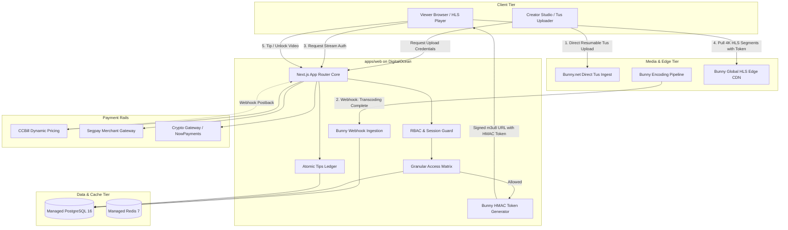
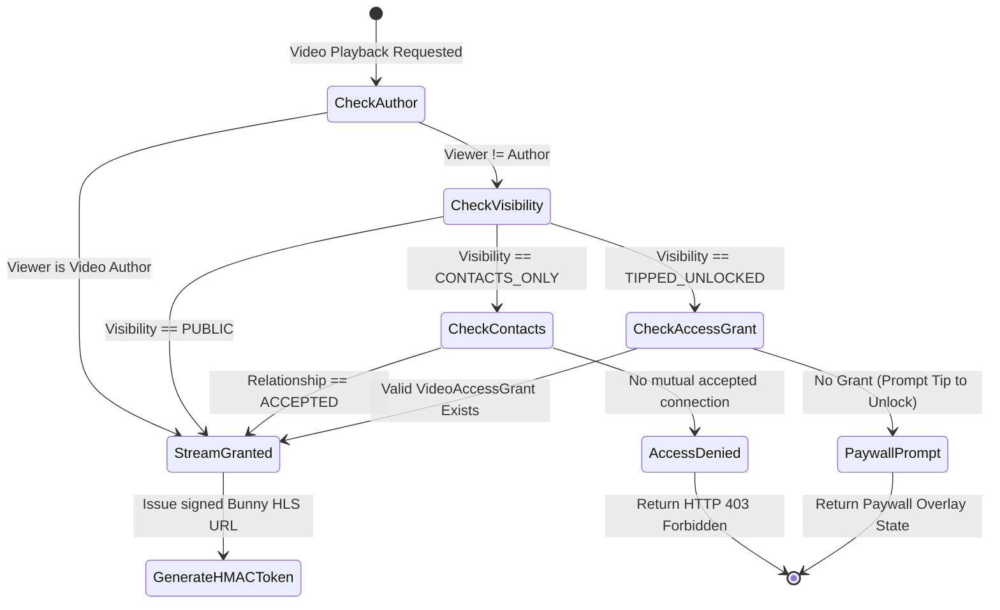

# 🏛️ Orochia Architecture Specification

Orochia is an adult-friendly, high-performance open-source video streaming and creator community platform designed by **Krizaka**. It decouples media transcoding and delivery to **Bunny.net Stream Edge CDN** while maintaining strict zero-trust access control, tokenized HMAC authorization, and an atomic financial ledger across adult-compliant payment processors.

---

## 1. System Topology Overview

---

## 2. Monorepo Package Boundaries

The repository is organized as an enterprise-grade TypeScript monorepo:

| Path | Name | Responsibilities |
| :--- | :--- | :--- |
| `apps/web` | `@orochia/web` | Next.js 14 App Router, Server Actions, HLS player UI, creator studio, health & Prometheus metrics. |
| `packages/db` | `@orochia/db` | PostgreSQL schema, Drizzle ORM relations, migrations, connection pool, and development seed factory. |
| `packages/media` | `@orochia/media` | Bunny.net Stream SDK wrapper, direct Tus signing, HMAC-SHA256 playlist token generator, and webhook verification. |
| `packages/payments` | `@orochia/payments` | Unified adapter interfaces for CCBill, Segpay, Crypto, and Stripe; atomic double-entry tips ledger. |
| `packages/config` | `@orochia/config` | Shared TypeScript, ESLint, and Tailwind presets. |
| `deploy/` | Infrastructure | Multi-stage Dockerfiles, Docker Compose dev/prod environments, and DigitalOcean App Platform spec. |

---

## 3. Access Control State Machine & IDOR Defense

Orochia implements strict zero-trust permission checks before ever signing a media playback token:

---

## 4. Financial Ledger Invariants

The tips engine operates on double-entry principles:
1. **Gross Invariance**: For every tip of amount $G$, `PlatformFee = round(G * FeePct)` and `CreatorCredit = G - PlatformFee`.
2. **Transaction Atomicity**: The tip debit, credit, profile stats update, video counter update, and `VideoAccessGrant` issuance are enclosed within a single PostgreSQL transaction (`db.transaction`).
3. **Escrow Solvency**: Payout disbursements cannot exceed `sum(net_amount_cents) - sum(payout_requests.amount_cents)`. Concurrency locks prevent double-spend during simultaneous payout requests.
