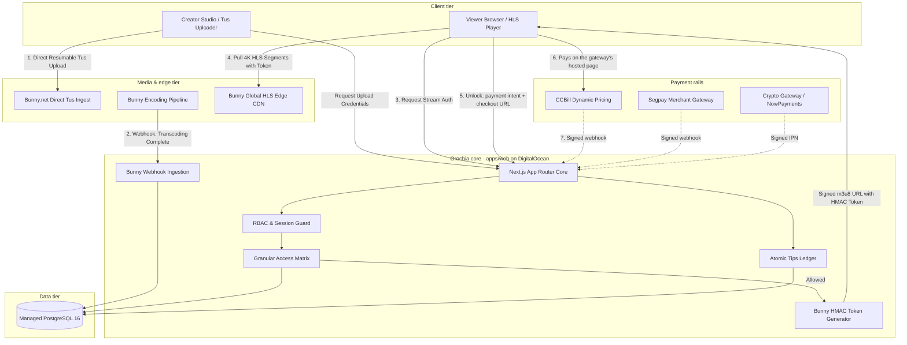
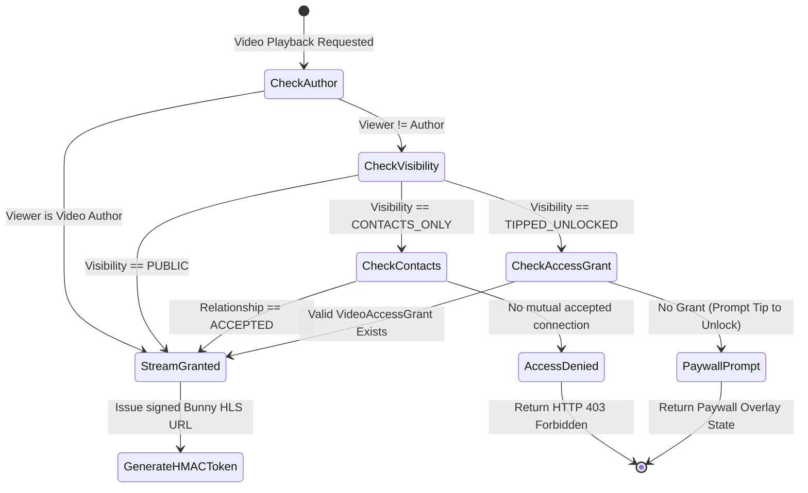
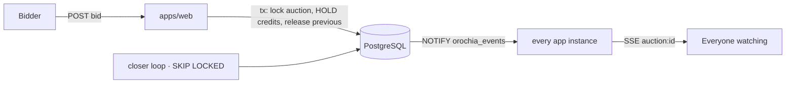

# 🏛️ Orochia Architecture Specification

Orochia is an adult-friendly, high-performance open-source video streaming and creator community platform designed by **Krizaka**. It decouples media transcoding and delivery to **Bunny.net Stream Edge CDN** while maintaining strict zero-trust access control, tokenized HMAC authorization, and an atomic financial ledger across adult-compliant payment processors.

---

## 1. System Topology Overview

---

## 2. Monorepo Package Boundaries

The repository is organized as an enterprise-grade TypeScript monorepo:

| Path | Name | Responsibilities |
| :--- | :--- | :--- |
| `apps/web` | `@orochia/web` | Next.js 16 App Router, Server Actions, HLS player UI, creator studio, health & Prometheus metrics. |
| `packages/db` | `@orochia/db` | PostgreSQL schema, Drizzle ORM relations, migrations, connection pool, and development seed factory. |
| `packages/media` | `@orochia/media` | Bunny.net Stream SDK wrapper, direct Tus signing, HMAC-SHA256 playlist token generator, and webhook verification. |
| `packages/payments` | `@orochia/payments` | Unified adapter interfaces for CCBill, Segpay, Crypto, and Stripe; atomic double-entry tips ledger. |
| `packages/config` | `@orochia/config` | Shared TypeScript, ESLint, and Tailwind presets. |
| `deploy/` | Infrastructure | Multi-stage Dockerfiles, Docker Compose dev/prod environments, and DigitalOcean App Platform spec. |

---

## 3. Access Control State Machine & IDOR Defense

Orochia implements strict zero-trust permission checks before ever signing a media playback token:

---

## 4. Payments — intents, checkout, signed settlement

The client is never trusted to say it paid.

1. `POST /api/videos/unlock-video` validates the video and amount, records a **payment intent**
   (`payment_intents`: buyer, creator, video, amount, gateway) and returns the gateway's
   **checkout URL** (CCBill FlexForms, Segpay hosted page, NowPayments invoice, Stripe Checkout).
   The intent id travels with the checkout as the gateway's reference.
2. The gateway calls `POST /api/webhooks/payments/{ccbill|segpay|crypto|stripe}`. The signature is
   verified over the **raw body** in constant time (Stripe: timestamp tolerance 300 s). An unsigned
   or forged call is refused (401) — there is no lenient mode in any environment.
3. The webhook says only *whether* and *how much* was paid. Who pays, who is paid and for which video
   come from the intent row, locked `FOR UPDATE` during settlement. An underpayment is not settled;
   a replayed webhook finds the intent `SUCCEEDED` and changes nothing; a unique index on
   `(gateway, gateway_transaction_ref)` for creator credits is the last line of defence.
4. Settlement writes the ledger credit, the counters and the `video_access_grants` row in the same
   transaction. The viewer's next `/stream` call is authorised.

A gateway is offered only when all of its credentials are configured (`configuredGateways()`); there
are no placeholder keys. In **demo mode** (`OROCHIA_DEMO_MODE=true`, never in production) with no
gateway configured, the intent is settled immediately so the showcase works without merchant accounts.

---

## 5. Financial Ledger Invariants

The tips engine operates on double-entry principles:
1. **Gross Invariance**: For every payment of amount $G$, `PlatformFee = round(G * FeePct)` and `CreatorCredit = G - PlatformFee` (they always add up to $G$).
2. **Transaction Atomicity**: the credit, the profile and video counters and the `VideoAccessGrant` are written in one PostgreSQL transaction, together with the intent's `SUCCEEDED` status.
3. **Escrow Solvency**: available balance = `sum(CREATOR_CREDIT net)` − `sum(payout_requests not FAILED)`. Payout ledger rows journal the same payouts and are not subtracted twice. Concurrent payout requests of one creator are serialised by `pg_advisory_xact_lock`.

---

## 6. Auctions and realtime

Creators can put a video up for auction; bids are **escrowed Orochia credits** (held while they lead, released when
outbid, spent when won), so a won auction is always paid. Every transition — bid, close, decision, cancellation — runs in
one PostgreSQL transaction under the auction's row lock. Realtime needs no broker: PostgreSQL `NOTIFY` fans events out
to every app instance, which streams them to browsers as Server-Sent Events; a per-instance loop closes due auctions
with `FOR UPDATE SKIP LOCKED`. Details, trade-offs and the point at which a broker would pay off:
[AUCTIONS.md](AUCTIONS.md).

## 7. Compliance

- Registration requires an explicit 18+ certification and acceptance of the terms.
- A creator can open an upload session only once their 18 U.S.C. § 2257 records are verified (`users.is_verified`).
- Content reports (non-consensual content, suspected minors, DMCA…) are persisted in `compliance_reports` before they are acknowledged; the ticket id returned is the row id.
