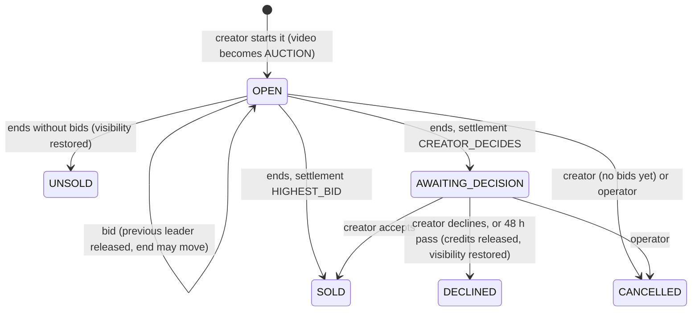

# 🔨 Auctions

A creator puts one of their videos up for auction between a start and an end. Members bid in **Orochia credits**; the
price moves **in real time** for everyone watching; when the auction ends, the highest bidder — and only them — gets the video:
to **watch**, or to **watch and download**, as the creator chose. The creator either **decides** (accepts or declines the
best bid within 48 hours) or lets it **sell to the highest bid** automatically.

---

## 1. The rules

| Rule | Value | Where |
| :--- | :--- | :--- |
| Starting price | from $1.00 | `packages/payments/src/auction-rules.ts` |
| Duration | 1 hour to 14 days, starting now or within 30 days | `checkAuctionSchedule` |
| Bid step | $0.50 under $10 · $1 under $50 · $5 under $200 · $10 under $1,000 · $25 above | `bidIncrementCents` |
| Anti-sniping (soft close) | a bid in the last 2 minutes moves the end to 2 minutes after it | `endAfterBid` |
| Creator's decision window | 48 hours, then the best bid is declined automatically | `AUCTION_DECISION_WINDOW_MS` |
| Exclusivity | while open, awaiting a decision or sold, the video's visibility is `AUCTION`: only its author and the winner play it | `lib/access.ts` |
| One auction per video | a sold video is never auctioned again (unique partial index) | `auctions_one_active_per_video_idx` |

The rules are pure functions shared by the server, the UI and the unit tests (`auction-rules.test.ts`).

## 2. Lifecycle



`OPEN` covers both *upcoming* and *open*; the UI phase (`UPCOMING`, `OPEN`, `ENDING`…) is derived from the clock
(`auctionPhase`). Every transition runs in **one transaction under the auction's row lock** (`SELECT … FOR UPDATE`),
so concurrent bids, the closer and the creator's decision serialise per auction and nothing happens twice.

## 3. Money: escrow in credits

Bids are paid in credits so that **the winner has always paid** — no unpaid wins, no chargeback race at the end.

| Moment | `wallet_ledger` (bidder) | `tips_ledger` (creator) |
| :--- | :--- | :--- |
| Bid placed | `HOLD −amount` (`hold_<bid>`) | — |
| Outbid / declined / cancelled | `RELEASE +amount` (`release_<bid>`) | — |
| Won | `RELEASE +amount` and `SPEND −amount` (`spend_auction_<auction>`) | `CREATOR_CREDIT` gross/fee/net, gateway `CREDITS`, ref `auction_<auction>` |

- A hold is taken under the bidder's **wallet advisory lock** — the same lock as every credit spend — so two bids (or a
  bid and an unlock) can never spend the same credits.
- At most one bid holds credits per auction (`auction_bids_one_leader_idx`).
- Every reference is unique: a retry can never move money twice. Balances stay computed from append-only ledgers.
- The winner's `video_access_grants` row (`granted_via = AUCTION`, `can_download`) is written in the same transaction.
- The wallet shows what is held behind leading bids (`heldCents` on `/api/me/wallet`).

## 4. Realtime without a broker

**No RabbitMQ, no Redis.** PostgreSQL — already paid for — does the three jobs a broker would do here:

| Need | Mechanism |
| :--- | :--- |
| Serialise bids on one auction | row lock `FOR UPDATE` on `auctions` |
| Push events to every app instance | `NOTIFY orochia_events` / one `LISTEN` connection per instance (`packages/db/src/listen.ts`) |
| Close auctions on time, once | a 5-second loop per instance picking due auctions with `FOR UPDATE SKIP LOCKED` (`lib/auction-scheduler.ts`, started by `instrumentation.ts`) |

`lib/realtime.ts` is the one bus of the web app: `publish(topic, event)` / `subscribe(topic, cb)` / `sseResponse(topics)`.
Topics: `auction:<id>` (public feed: amount, alias, new end, next minimum) and `user:<id>` (messages, notifications —
the messaging stream moved to the same bus, so it now works across instances too). Browsers receive Server-Sent Events
(`/api/auctions/[id]/stream`), reconnect by themselves, and reload the snapshot on reconnection; countdowns are aligned
on the server clock (`serverNow`). Reading an auction past its end closes it on the spot, so a stopped loop only
delays a notification, never a result.

**Why not RabbitMQ (yet).** A broker adds a service to run, secure, monitor and pay for (≈ $15–50/month managed, more
with high availability) for guarantees we already get transactionally from PostgreSQL: the bid and its money commit
together, and `NOTIFY` is delivered at commit. The current design holds comfortably to thousands of concurrent
viewers per instance and tens of bids per second per auction. Revisit when one of these is true: several services
(not just the web app) must react to auction events; sustained fan-out beyond ~10k concurrent streams; or a need for
durable replay of events. The natural next step then is a managed Redis/Valkey pub-sub for fan-out — the `realtime.ts`
interface stays the same.

**Operations note.** `LISTEN` needs a direct (session) connection: keep `DATABASE_URL` pointing at the database, not
at a transaction-mode pooler (PgBouncer). If the listener drops, it reconnects with back-off and events are delivered
to the local instance meanwhile.

## 5. Privacy

Bidders are shown under a per-auction alias — *Bidder 1, Bidder 2…* by order of first bid. A viewer sees *You* for
their own bids; only the creator sees the leader's username (to decide). Nobody's bidding history is public; the real-time
feed carries no identity.

## 6. API

| Endpoint | Who | What |
| :--- | :--- | :--- |
| `GET /api/auctions?tab=open\|upcoming\|ended\|bidding\|selling` | public / signed in | lists |
| `POST /api/auctions` | creator | start an auction for one of their ready videos |
| `GET /api/auctions/[id]` | public | the auction as the viewer sees it |
| `DELETE /api/auctions/[id]` | creator | cancel while nobody has bid |
| `POST /api/auctions/[id]/bids` | signed in | bid (402 with the balance when credits are short, 409 with the minimum when too low) |
| `POST /api/auctions/[id]/decision` | creator | accept or decline the best bid |
| `GET /api/auctions/[id]/stream` | public | Server-Sent Events |
| `GET /api/videos/[id]/auction` | public | the video's current auction |
| `GET /api/videos/[id]/download` | author, winner with download rights | 5-minute signed MP4 link (Bunny *MP4 fallback* must be on) |
| `GET /api/admin/auctions`, `DELETE /api/admin/auctions/[id]` | operator | list, cancel with a reason |

A takedown of the video or a suspension of its creator cancels its open auctions and releases the bids.

## 7. Notifications

`auctionAnnounced` (followers), `auctionNewBid`, `auctionDecision`, `auctionSold`, `auctionUnsold` (creator),
`auctionOutbid`, `auctionWon`, `auctionDeclined` (bidders) — in the bell, in real time, and by e-mail, each one switchable in
the notification settings; e-mails about one auction are throttled.

## 8. Where things are

```
packages/payments/src/auction-rules.ts    the rules (pure, unit-tested)
packages/payments/src/auctions.ts         the state machine and its money (transactions)
packages/db/src/schema/auctions.ts        auctions, auction_bids
packages/db/src/listen.ts                 LISTEN / NOTIFY
apps/web/lib/realtime.ts                  the realtime bus + SSE responses
apps/web/lib/auctions.ts                  read models, real-time feed, notifications, HTTP errors
apps/web/lib/auction-scheduler.ts         the closer
apps/web/components/auctions/             AuctionPanel, StartAuctionSheet, AuctionCard, useAuctionLive
apps/web/app/auctions/page.tsx            /auctions (tabs in the URL)
e2e/scenarios.mjs                         the scenarios (escrow, soft close, decision, sale, download, cancellations)
```

Shared UI comes from `@krizaka/orochia-design-system` ≥ 2.2: `Countdown` (one ticking clock for the page) and
`LiveBadge`.
