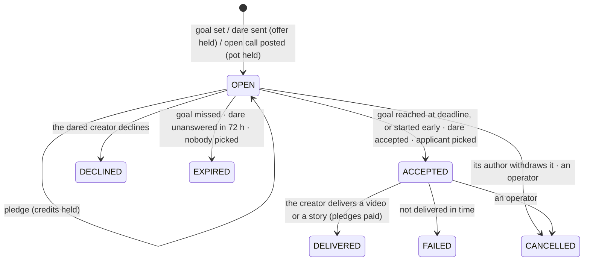

# 🔥 Challenges

Fans put credits behind something they want to see; a creator makes it. A challenge is **custom content with a game
around it**: a pot that fills in real time, a clock, a leaderboard of backers — and one rule that makes it fair for
everyone: **nobody pays for nothing**. Credits are held until the video or story is delivered and come straight back
when it does not happen.

---

## 1. What the industry does, and what Orochia takes from it

| Model | Who does it | What works | What fails |
| :--- | :--- | :--- | :--- |
| **Custom requests** (pay, then wait) | ManyVids custom vids, Fansly custom content | Fans get exactly what they asked for; creators set a price | Paid up front, delivery disputed afterwards: refunds go through support, and undelivered orders are the first complaint in reviews |
| **Accept or decline, refunded automatically** | Cameo | The creator answers within a window (days); declined or expired, the fan is never charged | One fan, one creator: no community, no momentum |
| **Tip goals** | Streamlabs and cam-site tip goals | A progress bar the audience fills together is the most engaging thing on the page | The money is kept whether or not the goal is reached — the "goal" is decorative |
| **All-or-nothing crowdfunding** | Kickstarter, charity streams | Backers pay only if the target is reached: trust by construction | Built for projects, not for a video next week |

Orochia combines the parts that work and removes the failure modes:

- **Escrow, not prepayment** — like an auction bid: credits are *held* (`wallet_ledger HOLD`), *paid* only on delivery,
  *released* otherwise. No support ticket ever decides a refund.
- **An answer within a window** — like Cameo: a dared creator has 3 days; silence is a decline.
- **A goal that means something** — like Kickstarter: below the goal at the deadline, everything comes back.
- **The game** — like a tip goal: a ring that fills live for everyone watching, backers ranked by alias, a countdown,
  notifications at every step.

## 2. Three kinds

| Kind | Who starts it | How it gets a creator | Money |
| :--- | :--- | :--- | :--- |
| **Goal** | a verified creator | it is theirs | fans pledge until the deadline; reached → the creator makes it (they may start early once reached) |
| **Dare** (`REQUEST`) | any member, to one verified creator who accepts dares | the creator accepts or declines within **72 hours** | the author's offer is held at once (at least the creator's minimum, $10 by default); anyone can add to it |
| **Open call** (`OPEN_CALL`) | any member | verified creators apply with a note; the author picks one before the deadline | the author's pot is held at once (from $5); anyone can add to it — but not an applicant |

Each one is delivered as a **video** (kept) or a **story** (24 hours), within **1 to 14 days** of the creator
committing. A goal also chooses **who watches it**: its backers only, or everyone (a goal reached for the whole
audience). Dares and open calls are always for their backers.

## 3. Lifecycle



Every transition runs in **one transaction under the challenge's row lock** (`packages/payments/src/challenges.ts`),
so pledges, answers, picks, deliveries and the closer serialise per challenge. The closer is the auction scheduler
(`lib/auction-scheduler.ts`, every 5 s, `SKIP LOCKED`); reading a challenge past its deadline settles it too.

The UI stage (`FUNDING`, `GOAL_REACHED`, `AWAITING_ANSWER`, `CASTING`, `CLOSING`, `IN_PROGRESS`…) is derived from the
status, the kind and the clock (`challengeStage`, pure).

## 4. Money: escrow in credits

| Moment | `wallet_ledger` (backer) | `tips_ledger` (creator) |
| :--- | :--- | :--- |
| Pledge (or the author's offer / pot) | `HOLD −amount` (`hold_cpl_<pledge>`) | — |
| Declined, expired, failed, cancelled | `RELEASE +amount` (`release_cpl_<pledge>`) | — |
| Delivered | `RELEASE +amount` and `SPEND −amount` (`spend_cpl_<pledge>`) | `CREATOR_CREDIT` per pledge, gateway `CREDITS`, ref `challenge_<pledge>` |

- Holds are taken under the backer's **wallet advisory lock** — the same one as bids and unlocks — so the same credits
  can never back two things.
- **Nobody is paid with their own credits**: the creator of a challenge cannot pledge on it; an open call's backer
  cannot apply to it, and an applicant cannot pledge on it.
- A video delivered to its backers gets visibility **`CHALLENGE`**: played by its author and by accounts holding a
  grant `granted_via = CHALLENGE`, written per backer in the delivery transaction (an earlier unlock is upgraded). Its
  audience is locked and it cannot be deleted by its creator — the backers paid for it. A story delivered to its
  backers gets visibility `CHALLENGE` and is shown to accounts whose pledge was paid.
- What is held behind pledges is part of `heldCents` on `/api/me/wallet`.

## 5. Privacy and safety

- Backers appear as **aliases** ("Backer 3", by first pledge); a viewer sees "You" for their own pledges. The member who
  sent a dare is visible **only to the creator it was sent to**; the author of an open call sees its applicants' notes.
- Only **2257-verified creators** set goals, receive dares, apply to open calls or deliver. A creator turns dares off
  or sets their minimum offer in *Settings → Challenges* (`profiles.challenge_requests_off`, `challenge_min_cents`).
- The composer reminds authors of the terms (adults only, consenting, nobody who did not agree to appear); creators
  decline anything they do not want to make, at no cost to anyone. A suspension cancels every challenge the account
  wrote or must make and releases its pledges.

## 6. API

| Endpoint | Access | What |
| :--- | :--- | :--- |
| `GET /api/challenges?tab=open\|calls\|done\|inbox\|mine\|backing` | public / signed in | lists |
| `POST /api/challenges` | signed in | open a goal (creators), a dare or an open call |
| `GET /api/challenges/[id]` | public | the challenge as the viewer sees it, with what they may do |
| `GET /api/challenges/[id]/stream` | public | Server-Sent Events: pledges (alias, amount, new total) and changes of state |
| `POST /api/challenges/[id]/pledges` | signed in | pledge credits |
| `POST /api/challenges/[id]/answer` | the dared creator | accept or decline |
| `POST /api/challenges/[id]/start` | the goal's creator | start once the goal is reached |
| `POST /api/challenges/[id]/applications` | verified creators | apply to an open call |
| `POST /api/challenges/[id]/assign` | the open call's author | pick an applicant |
| `GET`/`POST /api/challenges/[id]/delivery` | the committed creator | what can be delivered / deliver it |
| `POST /api/challenges/[id]/cancel` | its author | withdraw an open challenge |

Notifications (in the bell and by e-mail, each switchable): `challengeAnnounced`, `challengeRequested`,
`challengePledged`, `challengeFunded`, `challengeAccepted`, `challengeApplied`, `challengeChosen`,
`challengeDelivered`, `challengeReleased`, `challengeClosed`.

## 7. Where the code is

```
packages/db/src/schema/challenges.ts       challenges, challenge_pledges, challenge_applications
packages/payments/src/challenge-rules.ts   pure rules (limits, windows, stage, progress) + tests
packages/payments/src/challenges.ts        the state machine and its money
apps/web/lib/challenges.ts                 read models, real-time feed, notifications, HTTP errors
apps/web/app/api/challenges/**             the endpoints
apps/web/app/challenges/**                 /challenges (tabs in the URL) and /challenges/<id>
apps/web/components/challenges/**          card, meter, composer, pledge box, actions, stream hook
e2e/scenarios.mjs                          goal, dare, open call, expiry, failure, withdrawal
```
