# Database Reference

> Generated from `packages/db/src/schema` by `scripts/generate-docs.mjs` — do not hand-edit.
> To change the schema: edit it, `npm run db:generate`, review the SQL, `npm run db:migrate` — see the Development guide.

PostgreSQL 16 · 22 tables · 13 enums · 1 migrations (`packages/db/drizzle`).

## Relationships

```mermaid
erDiagram
    audience_lists ||--o{ audience_list_members : "list_id"
    users ||--o{ audience_list_members : "user_id"
    users ||--o{ audience_lists : "owner_id"
    videos ||--o{ compliance_reports : "video_id"
    users ||--o{ compliance_reports : "reporter_id"
    users ||--o{ contacts : "requester_id"
    users ||--o{ contacts : "addressee_id"
    users ||--o{ follows : "follower_id"
    users ||--o{ follows : "creator_id"
    users ||--o{ payment_intents : "sender_id"
    users ||--o{ payment_intents : "creator_id"
    videos ||--o{ payment_intents : "video_id"
    users ||--o{ payout_requests : "creator_id"
    playlists ||--o{ playlist_audience_lists : "playlist_id"
    audience_lists ||--o{ playlist_audience_lists : "list_id"
    playlists ||--o{ playlist_items : "playlist_id"
    videos ||--o{ playlist_items : "video_id"
    playlists ||--o{ playlist_members : "playlist_id"
    users ||--o{ playlist_members : "user_id"
    users ||--o{ playlists : "creator_id"
    users ||--o{ profiles : "user_id"
    users ||--o{ tips_ledger : "sender_id"
    users ||--o{ tips_ledger : "creator_id"
    videos ||--o{ tips_ledger : "video_id"
    videos ||--o{ video_access_grants : "video_id"
    users ||--o{ video_access_grants : "user_id"
    videos ||--o{ video_audience_lists : "video_id"
    audience_lists ||--o{ video_audience_lists : "list_id"
    videos ||--o{ video_comments : "video_id"
    users ||--o{ video_comments : "author_id"
    video_comments ||--o{ video_comments : "parent_id"
    users ||--o{ video_comments : "removed_by"
    videos ||--o{ video_likes : "video_id"
    users ||--o{ video_likes : "user_id"
    videos ||--o{ video_shares : "video_id"
    users ||--o{ video_shares : "user_id"
    videos ||--o{ video_viewers : "video_id"
    users ||--o{ video_viewers : "user_id"
    videos ||--o{ video_views : "video_id"
    users ||--o{ video_views : "viewer_id"
    users ||--o{ videos : "creator_id"
```

## Tables

### `audience_list_members`

| Column | Type | Null | Default | Notes |
| :--- | :--- | :--- | :--- | :--- |
| `id` | uuid | no | `gen_random_uuid()` | primary key |
| `list_id` | uuid | no |  | → `audience_lists.id` (on delete cascade) |
| `user_id` | uuid | no |  | → `users.id` (on delete cascade) |
| `created_at` | timestamp with time zone | no | `now()` |  |

**Indexes:** `audience_list_members_unique_idx` (unique, list_id, user_id) · `audience_list_members_user_idx` (user_id)

### `audience_lists`

| Column | Type | Null | Default | Notes |
| :--- | :--- | :--- | :--- | :--- |
| `id` | uuid | no | `gen_random_uuid()` | primary key |
| `owner_id` | uuid | no |  | → `users.id` (on delete cascade) |
| `name` | varchar(80) | no |  |  |
| `created_at` | timestamp with time zone | no | `now()` |  |
| `updated_at` | timestamp with time zone | no | `now()` |  |

**Indexes:** `audience_lists_owner_name_idx` (unique, owner_id, name)

### `compliance_reports`

| Column | Type | Null | Default | Notes |
| :--- | :--- | :--- | :--- | :--- |
| `id` | uuid | no | `gen_random_uuid()` | primary key |
| `video_id` | uuid | yes |  | → `videos.id` (on delete set null) |
| `video_title` | varchar(255) | no |  |  |
| `reason` | report_reason | no |  |  |
| `details` | text | no |  |  |
| `reporter_email` | varchar(255) | no |  |  |
| `reporter_id` | uuid | yes |  | → `users.id` (on delete set null) |
| `status` | report_status | no | `"OPEN"` |  |
| `created_at` | timestamp with time zone | no | `now()` |  |
| `resolved_at` | timestamp with time zone | yes |  |  |

**Indexes:** `compliance_reports_status_idx` (status, created_at)

### `contacts`

| Column | Type | Null | Default | Notes |
| :--- | :--- | :--- | :--- | :--- |
| `id` | uuid | no | `gen_random_uuid()` | primary key |
| `requester_id` | uuid | no |  | → `users.id` (on delete cascade) |
| `addressee_id` | uuid | no |  | → `users.id` (on delete cascade) |
| `status` | contact_status | no | `"PENDING"` |  |
| `created_at` | timestamp with time zone | no | `now()` |  |
| `updated_at` | timestamp with time zone | no | `now()` |  |

**Indexes:** `contacts_pair_idx` (unique, requester_id, addressee_id)

### `follows`

| Column | Type | Null | Default | Notes |
| :--- | :--- | :--- | :--- | :--- |
| `id` | uuid | no | `gen_random_uuid()` | primary key |
| `follower_id` | uuid | no |  | → `users.id` (on delete cascade) |
| `creator_id` | uuid | no |  | → `users.id` (on delete cascade) |
| `status` | follow_status | no | `"PENDING"` |  |
| `created_at` | timestamp with time zone | no | `now()` |  |
| `decided_at` | timestamp with time zone | yes |  |  |

**Indexes:** `follows_pair_idx` (unique, follower_id, creator_id) · `follows_creator_status_idx` (creator_id, status)

### `payment_intents`

| Column | Type | Null | Default | Notes |
| :--- | :--- | :--- | :--- | :--- |
| `id` | uuid | no | `gen_random_uuid()` | primary key |
| `gateway` | payment_gateway | no |  |  |
| `gateway_session_id` | varchar(255) | yes |  |  |
| `sender_id` | uuid | yes |  | → `users.id` (on delete set null) |
| `creator_id` | uuid | no |  | → `users.id` (on delete cascade) |
| `video_id` | uuid | yes |  | → `videos.id` (on delete set null) |
| `amount_cents` | integer | no |  |  |
| `currency` | varchar(3) | no | `"USD"` |  |
| `status` | payment_intent_status | no | `"PENDING"` |  |
| `gateway_transaction_ref` | varchar(255) | yes |  |  |
| `ledger_id` | uuid | yes |  |  |
| `created_at` | timestamp with time zone | no | `now()` |  |
| `updated_at` | timestamp with time zone | no | `now()` |  |

**Indexes:** `payment_intents_sender_idx` (sender_id) · `payment_intents_status_idx` (status)

### `payout_requests`

| Column | Type | Null | Default | Notes |
| :--- | :--- | :--- | :--- | :--- |
| `id` | uuid | no | `gen_random_uuid()` | primary key |
| `creator_id` | uuid | no |  | → `users.id` (on delete cascade) |
| `amount_cents` | integer | no |  |  |
| `status` | payout_status | no | `"REQUESTED"` |  |
| `payout_method` | varchar(50) | no |  |  |
| `payout_destination` | text | no |  |  |
| `tx_hash_or_reference` | text | yes |  |  |
| `failure_reason` | text | yes |  |  |
| `reviewed_at` | timestamp with time zone | yes |  |  |
| `settled_at` | timestamp with time zone | yes |  |  |
| `created_at` | timestamp with time zone | no | `now()` |  |
| `updated_at` | timestamp with time zone | no | `now()` |  |

**Indexes:** `payout_requests_creator_status_idx` (creator_id, status)

### `playlist_audience_lists`

| Column | Type | Null | Default | Notes |
| :--- | :--- | :--- | :--- | :--- |
| `id` | uuid | no | `gen_random_uuid()` | primary key |
| `playlist_id` | uuid | no |  | → `playlists.id` (on delete cascade) |
| `list_id` | uuid | no |  | → `audience_lists.id` (on delete cascade) |
| `created_at` | timestamp with time zone | no | `now()` |  |

**Indexes:** `playlist_audience_lists_unique_idx` (unique, playlist_id, list_id) · `playlist_audience_lists_list_idx` (list_id)

### `playlist_items`

| Column | Type | Null | Default | Notes |
| :--- | :--- | :--- | :--- | :--- |
| `id` | uuid | no | `gen_random_uuid()` | primary key |
| `playlist_id` | uuid | no |  | → `playlists.id` (on delete cascade) |
| `video_id` | uuid | no |  | → `videos.id` (on delete cascade) |
| `position` | integer | no | `0` |  |
| `created_at` | timestamp with time zone | no | `now()` |  |

**Indexes:** `playlist_items_position_idx` (playlist_id, position) · `playlist_video_unique_idx` (unique, playlist_id, video_id)

### `playlist_members`

| Column | Type | Null | Default | Notes |
| :--- | :--- | :--- | :--- | :--- |
| `id` | uuid | no | `gen_random_uuid()` | primary key |
| `playlist_id` | uuid | no |  | → `playlists.id` (on delete cascade) |
| `user_id` | uuid | no |  | → `users.id` (on delete cascade) |
| `created_at` | timestamp with time zone | no | `now()` |  |

**Indexes:** `playlist_members_unique_idx` (unique, playlist_id, user_id) · `playlist_members_user_idx` (user_id)

### `playlists`

| Column | Type | Null | Default | Notes |
| :--- | :--- | :--- | :--- | :--- |
| `id` | uuid | no | `gen_random_uuid()` | primary key |
| `creator_id` | uuid | no |  | → `users.id` (on delete cascade) |
| `title` | varchar(255) | no |  |  |
| `description` | text | yes |  |  |
| `visibility` | collection_visibility | no | `"PRIVATE"` |  |
| `created_at` | timestamp with time zone | no | `now()` |  |
| `updated_at` | timestamp with time zone | no | `now()` |  |

**Indexes:** `playlists_creator_idx` (creator_id)

### `profiles`

| Column | Type | Null | Default | Notes |
| :--- | :--- | :--- | :--- | :--- |
| `id` | uuid | no | `gen_random_uuid()` | primary key |
| `user_id` | uuid | no |  | unique · → `users.id` (on delete cascade) |
| `display_name` | varchar(100) | yes |  |  |
| `bio` | text | yes |  |  |
| `avatar_url` | text | yes |  |  |
| `banner_url` | text | yes |  |  |
| `website_url` | text | yes |  |  |
| `twitter_handle` | varchar(100) | yes |  |  |
| `min_tip_amount_cents` | integer | no | `500` |  |
| `payout_address_crypto` | text | yes |  |  |
| `payout_account_ccbill` | varchar(100) | yes |  |  |
| `total_views` | integer | no | `0` |  |
| `total_tips_earned_cents` | integer | no | `0` |  |
| `updated_at` | timestamp with time zone | no | `now()` |  |

### `tips_ledger`

| Column | Type | Null | Default | Notes |
| :--- | :--- | :--- | :--- | :--- |
| `id` | uuid | no | `gen_random_uuid()` | primary key |
| `entry_type` | ledger_entry_type | no |  |  |
| `sender_id` | uuid | yes |  | → `users.id` (on delete set null) |
| `creator_id` | uuid | no |  | → `users.id` (on delete cascade) |
| `video_id` | uuid | yes |  | → `videos.id` (on delete set null) |
| `gross_amount_cents` | integer | no |  |  |
| `platform_fee_cents` | integer | no | `0` |  |
| `net_amount_cents` | integer | no |  |  |
| `gateway` | payment_gateway | no |  |  |
| `gateway_transaction_ref` | varchar(255) | no |  |  |
| `note` | text | yes |  |  |
| `created_at` | timestamp with time zone | no | `now()` |  |

**Indexes:** `tips_ledger_creator_idx` (creator_id) · `tips_ledger_sender_idx` (sender_id) · `tips_ledger_video_idx` (video_id) · `tips_ledger_created_at_idx` (created_at) · `tips_ledger_credit_once_idx` (unique, gateway, gateway_transaction_ref, partial)

### `users`

| Column | Type | Null | Default | Notes |
| :--- | :--- | :--- | :--- | :--- |
| `id` | uuid | no | `gen_random_uuid()` | primary key |
| `email` | varchar(255) | no |  | unique |
| `username` | varchar(50) | no |  | unique |
| `password_hash` | text | no |  |  |
| `role` | user_role | no | `"MEMBER"` |  |
| `is_verified` | boolean | no | `false` |  |
| `is_age_verified` | boolean | no | `false` |  |
| `suspended_at` | timestamp with time zone | yes |  |  |
| `suspension_reason` | text | yes |  |  |
| `created_at` | timestamp with time zone | no | `now()` |  |
| `updated_at` | timestamp with time zone | no | `now()` |  |

### `video_access_grants`

| Column | Type | Null | Default | Notes |
| :--- | :--- | :--- | :--- | :--- |
| `id` | uuid | no | `gen_random_uuid()` | primary key |
| `video_id` | uuid | no |  | → `videos.id` (on delete cascade) |
| `user_id` | uuid | no |  | → `users.id` (on delete cascade) |
| `granted_via` | varchar(50) | no | `"TIP_PAYMENT"` |  |
| `amount_paid_cents` | integer | no |  |  |
| `transaction_ref` | text | no |  |  |
| `created_at` | timestamp with time zone | no | `now()` |  |

**Indexes:** `video_access_user_idx` (unique, video_id, user_id)

### `video_audience_lists`

| Column | Type | Null | Default | Notes |
| :--- | :--- | :--- | :--- | :--- |
| `id` | uuid | no | `gen_random_uuid()` | primary key |
| `video_id` | uuid | no |  | → `videos.id` (on delete cascade) |
| `list_id` | uuid | no |  | → `audience_lists.id` (on delete cascade) |
| `created_at` | timestamp with time zone | no | `now()` |  |

**Indexes:** `video_audience_lists_unique_idx` (unique, video_id, list_id) · `video_audience_lists_list_idx` (list_id)

### `video_comments`

| Column | Type | Null | Default | Notes |
| :--- | :--- | :--- | :--- | :--- |
| `id` | uuid | no | `gen_random_uuid()` | primary key |
| `video_id` | uuid | no |  | → `videos.id` (on delete cascade) |
| `author_id` | uuid | no |  | → `users.id` (on delete cascade) |
| `parent_id` | uuid | yes |  | → `video_comments.id` (on delete cascade) |
| `body` | text | no |  |  |
| `created_at` | timestamp with time zone | no | `now()` |  |
| `edited_at` | timestamp with time zone | yes |  |  |
| `removed_at` | timestamp with time zone | yes |  |  |
| `removed_by` | uuid | yes |  | → `users.id` (on delete set null) |

**Indexes:** `video_comments_video_created_idx` (video_id, created_at) · `video_comments_parent_idx` (parent_id)

### `video_likes`

| Column | Type | Null | Default | Notes |
| :--- | :--- | :--- | :--- | :--- |
| `id` | uuid | no | `gen_random_uuid()` | primary key |
| `video_id` | uuid | no |  | → `videos.id` (on delete cascade) |
| `user_id` | uuid | no |  | → `users.id` (on delete cascade) |
| `created_at` | timestamp with time zone | no | `now()` |  |

**Indexes:** `video_likes_once_idx` (unique, video_id, user_id) · `video_likes_user_idx` (user_id)

### `video_shares`

| Column | Type | Null | Default | Notes |
| :--- | :--- | :--- | :--- | :--- |
| `id` | uuid | no | `gen_random_uuid()` | primary key |
| `video_id` | uuid | no |  | → `videos.id` (on delete cascade) |
| `user_id` | uuid | yes |  | → `users.id` (on delete set null) |
| `channel` | share_channel | no | `"LINK"` |  |
| `created_at` | timestamp with time zone | no | `now()` |  |

**Indexes:** `video_shares_video_idx` (video_id)

### `video_viewers`

| Column | Type | Null | Default | Notes |
| :--- | :--- | :--- | :--- | :--- |
| `id` | uuid | no | `gen_random_uuid()` | primary key |
| `video_id` | uuid | no |  | → `videos.id` (on delete cascade) |
| `user_id` | uuid | no |  | → `users.id` (on delete cascade) |
| `created_at` | timestamp with time zone | no | `now()` |  |

**Indexes:** `video_viewers_unique_idx` (unique, video_id, user_id) · `video_viewers_user_idx` (user_id)

### `video_views`

| Column | Type | Null | Default | Notes |
| :--- | :--- | :--- | :--- | :--- |
| `id` | uuid | no | `gen_random_uuid()` | primary key |
| `video_id` | uuid | no |  | → `videos.id` (on delete cascade) |
| `viewer_id` | uuid | yes |  | → `users.id` (on delete set null) |
| `viewer_key` | varchar(80) | no |  |  |
| `viewed_on` | date | no | `now()` |  |
| `created_at` | timestamp with time zone | no | `now()` |  |

**Indexes:** `video_views_once_per_day_idx` (unique, video_id, viewer_key, viewed_on) · `video_views_video_day_idx` (video_id, viewed_on)

### `videos`

| Column | Type | Null | Default | Notes |
| :--- | :--- | :--- | :--- | :--- |
| `id` | uuid | no | `gen_random_uuid()` | primary key |
| `creator_id` | uuid | no |  | → `users.id` (on delete cascade) |
| `bunny_video_id` | varchar(120) | no |  | unique |
| `title` | varchar(255) | no |  |  |
| `description` | text | yes |  |  |
| `visibility` | video_visibility | no | `"PUBLIC"` |  |
| `status` | video_status | no | `"PENDING_UPLOAD"` |  |
| `min_tip_amount_cents` | integer | no | `0` |  |
| `duration_seconds` | integer | no | `0` |  |
| `thumbnail_url` | text | yes |  |  |
| `preview_animation_url` | text | yes |  |  |
| `views_count` | integer | no | `0` |  |
| `tips_count` | integer | no | `0` |  |
| `likes_count` | integer | no | `0` |  |
| `comments_count` | integer | no | `0` |  |
| `shares_count` | integer | no | `0` |  |
| `comments_enabled` | boolean | no | `true` |  |
| `resolutions` | text[] | yes |  |  |
| `tags` | text[] | yes |  |  |
| `removed_at` | timestamp with time zone | yes |  |  |
| `removal_reason` | text | yes |  |  |
| `created_at` | timestamp with time zone | no | `now()` |  |
| `updated_at` | timestamp with time zone | no | `now()` |  |

**Indexes:** `videos_creator_idx` (creator_id) · `videos_visibility_idx` (visibility) · `videos_status_idx` (status) · `videos_created_at_idx` (created_at)

## Enums

| Enum | Values |
| :--- | :--- |
| `collection_visibility` | `PUBLIC`, `APPROVED_FOLLOWERS_ONLY`, `CONTACTS_ONLY`, `INVITED_ONLY`, `PRIVATE` |
| `contact_status` | `PENDING`, `ACCEPTED`, `REJECTED`, `BLOCKED` |
| `follow_status` | `PENDING`, `APPROVED` |
| `ledger_entry_type` | `TIP_RECEIVED`, `PLATFORM_FEE`, `CREATOR_CREDIT`, `PAYOUT_REQUESTED`, `PAYOUT_COMPLETED`, `REFUND` |
| `payment_gateway` | `CCBILL`, `SEGPAY`, `CRYPTO`, `STRIPE` |
| `payment_intent_status` | `PENDING`, `SUCCEEDED`, `FAILED` |
| `payout_status` | `REQUESTED`, `UNDER_REVIEW`, `PROCESSING`, `SETTLED`, `FAILED` |
| `report_reason` | `NON_CONSENSUAL`, `UNDERAGE`, `DMCA_COPYRIGHT`, `TERMS_VIOLATION`, `FRAUD_SCAM` |
| `report_status` | `OPEN`, `IN_REVIEW`, `RESOLVED` |
| `share_channel` | `LINK`, `X`, `WHATSAPP`, `TELEGRAM`, `EMAIL`, `OTHER` |
| `user_role` | `ADMIN`, `CREATOR`, `MEMBER` |
| `video_status` | `PENDING_UPLOAD`, `PROCESSING`, `READY`, `FAILED` |
| `video_visibility` | `PUBLIC`, `CONTACTS_ONLY`, `APPROVED_FOLLOWERS_ONLY`, `TIPPED_UNLOCKED`, `INVITED_ONLY` |

## Migrations

- `0000_initial_schema.sql`
