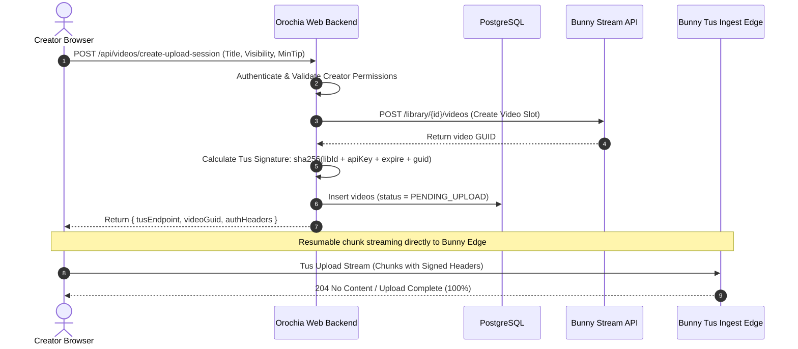
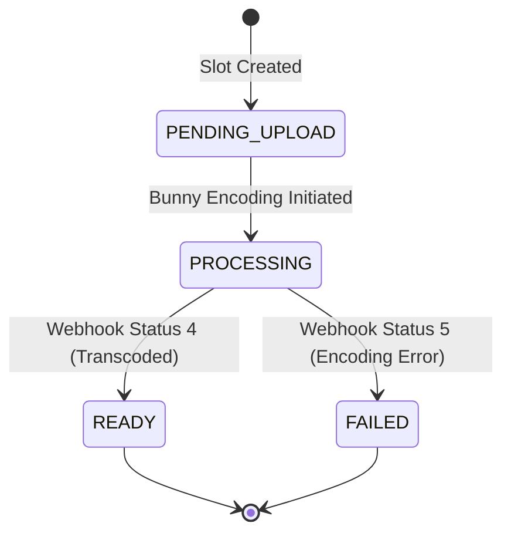

# 🎬 Bunny.net Stream Media Pipeline

Orochia is engineered to provide adult-compliant, ultra-fast 4K video streaming with zero server bandwidth overhead by offloading ingest and delivery to **Bunny.net Stream**.

---

## 1. Direct-to-Bunny Tus Resumable Upload Flow

Rather than streaming heavy video files through application server instances, Orochia uses direct-to-edge resumable uploads via the open Tus protocol.



---

## 2. Tokenized Playback Security (HMAC-SHA256)

To protect paywalled and private videos against hotlinking, URL scraping, and unauthorized downloading:

1. Videos are stored in a Bunny Video Library with **Token Authentication Enabled**.
2. Unsigned direct URLs return HTTP 403 Forbidden at Bunny's edge CDN.
3. When an authorized viewer requests a stream, Orochia generates an expiring HMAC-SHA256 token:

$$\text{hashableBase} = \text{tokenAuthKey} + \text{path} + \text{expires} + [\text{userIp}]$$
$$\text{token} = \text{base64url}(\text{sha256}(\text{hashableBase}))$$

The player requests:
```text
https://{hostname}/{videoGuid}/playlist.m3u8?token={token}&expires={expires}
```

Bunny edge servers verify the hash before serving `.m3u8` manifests and `.ts` / `.m4s` video segments.

---

## 3. Webhook Transcoding Lifecycle



When Bunny completes encoding:
- Dispatches webhook to `POST /api/webhooks/bunny`.
- Orochia verifies the HMAC signature header against `BUNNY_WEBHOOK_SECRET`.
- Updates resolutions list (`2160p`, `1080p`, `720p`, `480p`), duration, and thumbnail preview URLs.
