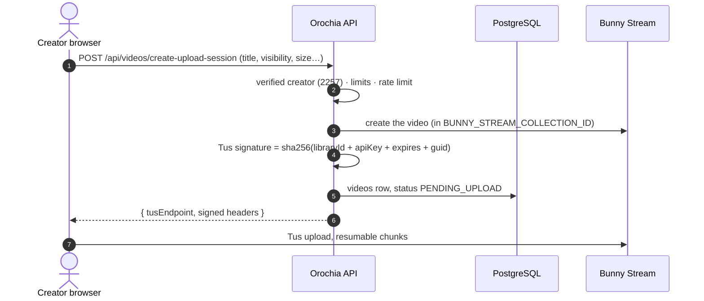

# 🎬 Media Pipeline

Video never passes through the Orochia servers: the browser edits it, sends it straight to **Bunny Stream** over Tus,
Bunny encodes it and reports back through a signed webhook, and every play is a short-lived signed URL issued only
after the app has decided the viewer may watch.

---

## 1. Edit in the browser (optional)

Before an upload the creator can open the editor — trim with a filmstrip and two handles, speed 0.5–2×, 14 looks,
brightness / contrast / colour, crop to 9:16 or 1:1 by dragging the picture, sound volume up to 200 %, fades, noise
reduction and a music track mixed in. The preview is live (CSS, Web Audio); **Apply** renders the exact result with
**ffmpeg.wasm** on the device (H.264 / AAC MP4, 1080 px on the short side at most). Nothing is uploaded to do it.

Editing is non-destructive: the original stays on the device and reopens with its last settings. **Stories** are always
vertical 9:16 and at most 60 seconds — a story clip goes through the editor before it can be shared.

**Drafts.** *Save draft* keeps the original at Bunny (drafts collection, sent once over Tus), the settings and the form
in `video_drafts` and the music privately in storage, so the edit continues on any device. Saving again only updates
the settings. A draft is removed with its files when published, deleted, or after `DRAFT_RETENTION_DAYS` (30).

## 2. Limits

One table, `packages/media/src/limits.ts`, read by the browser and the server:

| What | Size | Length |
| :--- | :--- | :--- |
| Video | 4 GB | 3 hours |
| Story clip | 250 MB | 60 seconds |
| Draft original (what the editor opens) | 400 MB | — |
| Draft music | 25 MB | — |

The browser refuses before sending; the upload session refuses a larger declared size; the webhook reads the encoded
length and deletes at Bunny a video or story longer than allowed (status FAILED).

## 3. Direct-to-Bunny Tus upload



Story videos (`/api/stories/upload-session`) and draft originals (`/api/me/drafts`) take the same path into their own
collections.

## 4. Encoding webhook

`POST /api/webhooks/bunny` — signature v1 (HMAC-SHA256 over the raw body with the library's Read-Only key,
`BUNNY_WEBHOOK_SECRET`), compared in constant time.

| Bunny status | Orochia |
| :--- | :--- |
| 0 queued · 1 processing · 2 encoding · 4 resolution finished · 6–7 presigned upload started / finished | `PROCESSING` |
| 3 finished | `READY` — length, renditions and thumbnail read from the Stream API |
| 5 failed · 8 presigned upload failed | `FAILED` |
| 9–10 captions / title generated | ignored |

Events can arrive late or out of order: a READY video never goes back to PROCESSING. The GUID finds a video, else a
story (its 24 hours start at READY), else a draft.

## 5. Signed playback

The library has **CDN token authentication** on and only allows the app's domains, so an unsigned URL answers 403.
After `evaluateVideoAccess` allows the viewer, `/api/videos/[id]/stream` signs a token for the video's directory,
valid **300 seconds**:

```text
https://{hostname}/bcdn_token={token}&expires={expires}&token_path=%2F{guid}%2F/{guid}/playlist.m3u8
token = base64url(sha256(tokenAuthKey + "/{guid}/" + expires + "token_path=/{guid}/"))
```

The token is in the path, not the query, because HLS players request renditions and segments by relative URL — the
path prefix is kept, a query string would be dropped. Thumbnails and preview animations are signed one file at a time
(`?token=…&expires=…`, 6-hour windows), which never opens the renditions.
